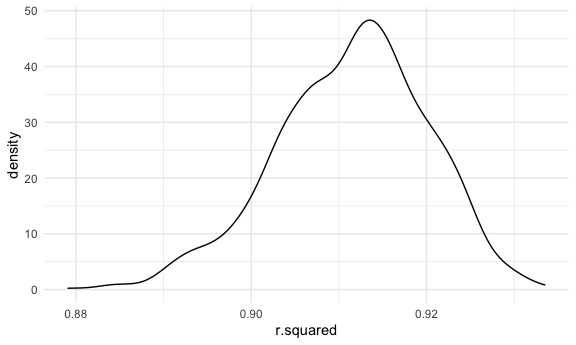
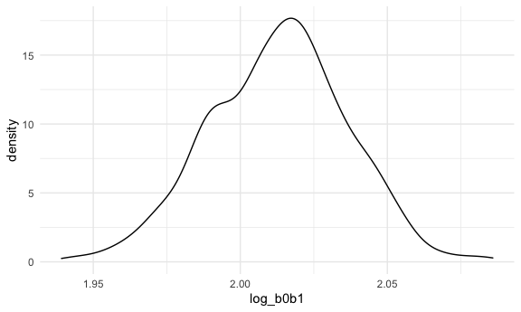
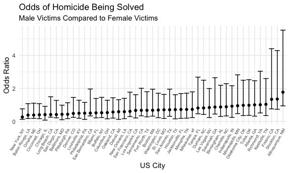
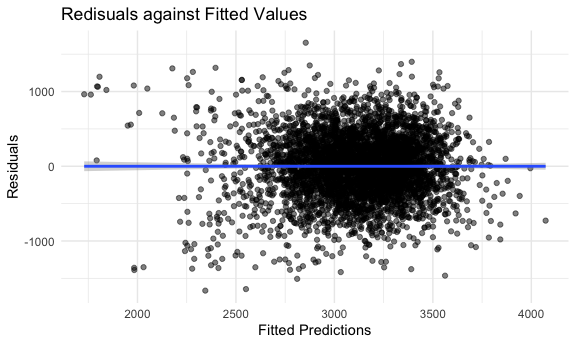
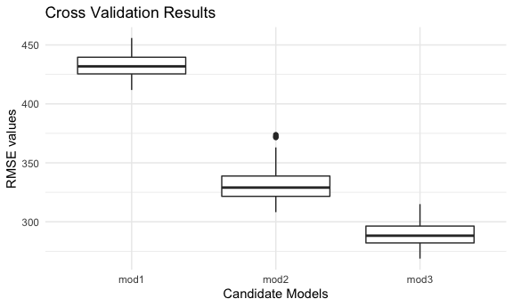

p8105_hw6_ltc2121
================
Lindsey Covell

## Problem 1

To obtain a distribution for $\hat{r}^2$, we’ll follow basically the
same procedure we used for regression coefficients: draw bootstrap
samples; the a model to each; extract the value I’m concerned with; and
summarize. Here, we’ll use `modelr::bootstrap` to draw the samples and
`broom::glance` to produce `r.squared` values.

``` r
weather_df = 
  rnoaa::meteo_pull_monitors(
    c("USW00094728"),
    var = c("PRCP", "TMIN", "TMAX"), 
    date_min = "2017-01-01",
    date_max = "2017-12-31") %>%
  mutate(
    name = recode(id, USW00094728 = "CentralPark_NY"),
    tmin = tmin / 10,
    tmax = tmax / 10) %>%
  select(name, id, everything())
```

    ## Registered S3 method overwritten by 'hoardr':
    ##   method           from
    ##   print.cache_info httr

    ## using cached file: ~/Library/Caches/R/noaa_ghcnd/USW00094728.dly

    ## date created (size, mb): 2022-03-22 14:09:01 (7.641)

    ## file min/max dates: 1869-01-01 / 2022-03-31

``` r
weather_df %>% 
  modelr::bootstrap(n = 1000) %>% 
  mutate(
    models = map(strap, ~lm(tmax ~ tmin, data = .x) ),
    results = map(models, broom::glance)) %>% 
  select(-strap, -models) %>% 
  unnest(results) %>% 
  ggplot(aes(x = r.squared)) + geom_density()
```



In this example, the $\hat{r}^2$ value is high, and the upper bound at 1
may be a cause for the generally skewed shape of the distribution. If we
wanted to construct a confidence interval for $R^2$, we could take the
2.5% and 97.5% quantiles of the estimates across bootstrap samples.
However, because the shape isn’t symmetric, using the mean +/- 1.96
times the standard error probably wouldn’t work well.

We can produce a distribution for $\log(\beta_0 * \beta1)$ using a
similar approach, with a bit more wrangling before we make our plot.

``` r
weather_df %>% 
  modelr::bootstrap(n = 1000) %>% 
  mutate(
    models = map(strap, ~lm(tmax ~ tmin, data = .x) ),
    results = map(models, broom::tidy)) %>% 
  select(-strap, -models) %>% 
  unnest(results) %>% 
  select(id = `.id`, term, estimate) %>% 
  pivot_wider(
    names_from = term, 
    values_from = estimate) %>% 
  rename(beta0 = `(Intercept)`, beta1 = tmin) %>% 
  mutate(log_b0b1 = log(beta0 * beta1)) %>% 
  ggplot(aes(x = log_b0b1)) + geom_density()
```



As with $r^2$, this distribution is somewhat skewed and has some
outliers.

The point of this is not to say you should always use the bootstrap –
it’s possible to establish “large sample” distributions for strange
parameters / values / summaries in a lot of cases, and those are great
to have. But it is helpful to know that there’s a way to do inference
even in tough cases.

## Problem 2

#### Data import and manipulation

``` r
washp_df = 
  read_csv("data/homicide-data copy.csv") %>% 
  filter(victim_race %in% c("White", "Black")) %>% 
  mutate(city_state = str_c(city, state, sep = ", "),
         resolved = as.numeric(disposition == "Closed by arrest"),
          victim_age = as.numeric(victim_age),
          victim_race = fct_relevel(victim_race, "White"))  %>% 
  filter(city != "Dallas" & city != "Phoenix" & 
           city != "Kansas City" & city_state != "Tulsa, AL") 
```

    ## Rows: 52179 Columns: 12
    ## ── Column specification ────────────────────────────────────────────────────────
    ## Delimiter: ","
    ## chr (9): uid, victim_last, victim_first, victim_race, victim_age, victim_sex...
    ## dbl (3): reported_date, lat, lon
    ## 
    ## ℹ Use `spec()` to retrieve the full column specification for this data.
    ## ℹ Specify the column types or set `show_col_types = FALSE` to quiet this message.

#### Baltimore, MD glm

``` r
balti_log = 
  washp_df %>% 
  filter(city == "Baltimore") %>%
  glm(resolved ~ victim_age + victim_race + victim_sex, data = ., family = binomial()) %>% 
  broom::tidy() %>% 
  mutate(OR = exp(estimate), 
         CI_low = exp(estimate - 1.96 * std.error), 
         CI_high = exp(estimate + 1.96 * std.error)) %>%
  filter(term == "victim_sexMale") %>% 
  select(term, OR, CI_low, CI_high) 

balti_log %>% 
  knitr::kable(digits = 3)
```

| term           |    OR | CI_low | CI_high |
|:---------------|------:|-------:|--------:|
| victim_sexMale | 0.426 |  0.325 |   0.558 |

The table above shows the odds of a homicide with a male victim being
solved compared to a homicide with a female victim keeping all other
variables fixed for Baltimore, MD.

#### All cities glm

``` r
wash_logit = 
  washp_df %>% 
  select(city_state, resolved, victim_age, victim_race, victim_sex) %>% 
  nest(data = resolved:victim_sex) %>% 
  mutate(
    city_logs = map(.x = data, ~glm(resolved ~ victim_age + victim_race + victim_sex, data = .x, family = binomial())),
  city_res = map(city_logs, broom::tidy)) %>% 
  unnest(city_res) %>% 
  mutate(OR = exp(estimate), 
         CI_low = exp(estimate - 1.96 * std.error), 
         CI_high = exp(estimate + 1.96 * std.error)) %>%
  filter(term == "victim_sexMale") %>% 
  select(city_state, term, OR, CI_low, CI_high) 

wash_logit %>% 
  knitr::kable(digits = 3)
```

| city_state         | term           |    OR | CI_low | CI_high |
|:-------------------|:---------------|------:|-------:|--------:|
| Albuquerque, NM    | victim_sexMale | 1.767 |  0.831 |   3.761 |
| Atlanta, GA        | victim_sexMale | 1.000 |  0.684 |   1.463 |
| Baltimore, MD      | victim_sexMale | 0.426 |  0.325 |   0.558 |
| Baton Rouge, LA    | victim_sexMale | 0.381 |  0.209 |   0.695 |
| Birmingham, AL     | victim_sexMale | 0.870 |  0.574 |   1.318 |
| Boston, MA         | victim_sexMale | 0.674 |  0.356 |   1.276 |
| Buffalo, NY        | victim_sexMale | 0.521 |  0.290 |   0.935 |
| Charlotte, NC      | victim_sexMale | 0.884 |  0.557 |   1.403 |
| Chicago, IL        | victim_sexMale | 0.410 |  0.336 |   0.501 |
| Cincinnati, OH     | victim_sexMale | 0.400 |  0.236 |   0.677 |
| Columbus, OH       | victim_sexMale | 0.532 |  0.378 |   0.750 |
| Denver, CO         | victim_sexMale | 0.479 |  0.236 |   0.971 |
| Detroit, MI        | victim_sexMale | 0.582 |  0.462 |   0.734 |
| Durham, NC         | victim_sexMale | 0.812 |  0.392 |   1.683 |
| Fort Worth, TX     | victim_sexMale | 0.669 |  0.397 |   1.127 |
| Fresno, CA         | victim_sexMale | 1.335 |  0.580 |   3.071 |
| Houston, TX        | victim_sexMale | 0.711 |  0.558 |   0.907 |
| Indianapolis, IN   | victim_sexMale | 0.919 |  0.679 |   1.242 |
| Jacksonville, FL   | victim_sexMale | 0.720 |  0.537 |   0.966 |
| Las Vegas, NV      | victim_sexMale | 0.837 |  0.608 |   1.154 |
| Long Beach, CA     | victim_sexMale | 0.410 |  0.156 |   1.082 |
| Los Angeles, CA    | victim_sexMale | 0.662 |  0.458 |   0.956 |
| Louisville, KY     | victim_sexMale | 0.491 |  0.305 |   0.790 |
| Memphis, TN        | victim_sexMale | 0.723 |  0.529 |   0.988 |
| Miami, FL          | victim_sexMale | 0.515 |  0.304 |   0.872 |
| Milwaukee, wI      | victim_sexMale | 0.727 |  0.499 |   1.060 |
| Minneapolis, MN    | victim_sexMale | 0.947 |  0.478 |   1.875 |
| Nashville, TN      | victim_sexMale | 1.034 |  0.685 |   1.562 |
| New Orleans, LA    | victim_sexMale | 0.585 |  0.422 |   0.811 |
| New York, NY       | victim_sexMale | 0.262 |  0.138 |   0.499 |
| Oakland, CA        | victim_sexMale | 0.563 |  0.365 |   0.868 |
| Oklahoma City, OK  | victim_sexMale | 0.974 |  0.624 |   1.520 |
| Omaha, NE          | victim_sexMale | 0.382 |  0.203 |   0.721 |
| Philadelphia, PA   | victim_sexMale | 0.496 |  0.378 |   0.652 |
| Pittsburgh, PA     | victim_sexMale | 0.431 |  0.265 |   0.700 |
| Richmond, VA       | victim_sexMale | 1.006 |  0.498 |   2.033 |
| San Antonio, TX    | victim_sexMale | 0.705 |  0.398 |   1.249 |
| Sacramento, CA     | victim_sexMale | 0.669 |  0.335 |   1.337 |
| Savannah, GA       | victim_sexMale | 0.867 |  0.422 |   1.780 |
| San Bernardino, CA | victim_sexMale | 0.500 |  0.171 |   1.462 |
| San Diego, CA      | victim_sexMale | 0.413 |  0.200 |   0.855 |
| San Francisco, CA  | victim_sexMale | 0.608 |  0.317 |   1.165 |
| St. Louis, MO      | victim_sexMale | 0.703 |  0.530 |   0.932 |
| Stockton, CA       | victim_sexMale | 1.352 |  0.621 |   2.942 |
| Tampa, FL          | victim_sexMale | 0.808 |  0.348 |   1.876 |
| Tulsa, OK          | victim_sexMale | 0.976 |  0.614 |   1.552 |
| Washington, DC     | victim_sexMale | 0.690 |  0.468 |   1.017 |

#### Box plot for city estimates

``` r
wash_logit %>% 
  mutate(city_state = fct_reorder(city_state, OR)) %>% 
ggplot() +
  geom_point(aes(x = city_state, y = OR)) +
  geom_errorbar( aes(x = city_state, ymin = OR - CI_low, ymax = OR + CI_high)) +
  theme(axis.text.x = element_text(angle = 60, hjust = 1, size = 6)) +
   labs(
    title = "Odds of Homicide Being Solved", 
    subtitle = "Male Victims Compared to Female Victims",
    x = "US City",
    y = "Odds Ratio")
```



The graph shows the odds ratio of a homicide being solved with a male
victim compared to a homicide with a female victim while keeping all
other variables fixed across numerous US cities. An odds ratio of less
than 1 means that homicides in which the victim is male are less like to
be resolved than those in which the victim is female. A majority of the
cities analyzed and shown in the graph have an odd ratio less than 1.
This indicates that a majority of the cities have homicides in which the
victim is male are less like to be resolved than those in which the
victim is female

## Problem 3

#### Data import and manipulation

``` r
birth_wt = 
  read_csv("data/birthweight.csv") %>% 
  set_value_labels(babysex = c("male" = 1, "female" = 2),
                   frace = c("White" = 1, "Black" = 2, "Asain" = 3, "Puerto Rican" = 4, "Other" = 8, "Unknown" = 9), 
                   malform = c("absent" = 0, "present" = 1), 
                   mrace = c("White" = 1, "Black" = 2, "Asain" = 3, "Puerto Rican" = 4, "Other" = 8)) %>%
  mutate_if(is.labelled, to_factor)
```

    ## Rows: 4342 Columns: 20
    ## ── Column specification ────────────────────────────────────────────────────────
    ## Delimiter: ","
    ## dbl (20): babysex, bhead, blength, bwt, delwt, fincome, frace, gaweeks, malf...
    ## 
    ## ℹ Use `spec()` to retrieve the full column specification for this data.
    ## ℹ Specify the column types or set `show_col_types = FALSE` to quiet this message.

#### Proposed model

``` r
mod_1_bw = 
  birth_wt %>% 
  lm(bwt ~ smoken + wtgain + babysex + gaweeks + momage + mrace, data = .) 

mod_1_bw %>% 
  broom::tidy() %>% 
    knitr::kable(digits = 3)
```

| term              | estimate | std.error | statistic | p.value |
|:------------------|---------:|----------:|----------:|--------:|
| (Intercept)       |  868.314 |    92.422 |     9.395 |   0.000 |
| smoken            |  -11.357 |     0.916 |   -12.402 |   0.000 |
| wtgain            |    9.271 |     0.610 |    15.202 |   0.000 |
| babysexfemale     |  -86.036 |    13.144 |    -6.546 |   0.000 |
| gaweeks           |   54.912 |     2.144 |    25.612 |   0.000 |
| momage            |    4.820 |     1.831 |     2.632 |   0.009 |
| mraceBlack        | -275.543 |    15.075 |   -18.278 |   0.000 |
| mraceAsain        | -199.034 |    67.030 |    -2.969 |   0.003 |
| mracePuerto Rican | -168.285 |    29.619 |    -5.682 |   0.000 |

#### Diagnostic visual

``` r
birth_wt %>% 
  add_predictions(mod_1_bw) %>% 
  add_residuals(mod_1_bw) %>% 
  ggplot(aes(x = pred, y = resid)) + 
  geom_point(alpha = 0.5) + 
  geom_smooth(method = lm ) +
   labs(
    title = "Redisuals against Fitted Values",
    x = "Fitted Predictions",
    y = "Residuals") 
```

    ## `geom_smooth()` using formula 'y ~ x'



I proposed the built model off of several factors that have been used in
previous literature to show an impact infant birth weight. This includes
smoking status during pregnancy, infant biological sex, maternal race,
and maternal age. Other factors that I hypothesized would have an impact
include gestational age in weeks and mothers weight gain during
pregnancy.

The model is supported with the diagnostic plot which shows the
residuals plotted against the fitted values. This plot shows that the
spread of residuals is generally consistent across the fitted values.
There are a few outlines on each side which could be further
investigated with quantitative residual testing.

#### Model comparison

``` r
cv_df = 
  crossv_mc(birth_wt, 100) %>% 
  mutate(
    train = map(train, as_tibble),
    test = map(test, as_tibble),
  ) %>% 
  mutate(
    mod_1 = map(.x = train, ~lm(bwt ~ smoken + wtgain + babysex + gaweeks + momage + mrace, data = .)),
    mod_2 =    map(.x = train, ~lm(bwt ~ gaweeks + blength, data = .)),
    mod_3 = map(.x = train, ~lm(bwt ~ bhead + blength + babysex + bhead * babysex + bhead * blength + babysex * blength + bhead * blength * babysex, data = .))
  ) %>% 
  mutate(
    rmse_mod1 = map2_dbl(.x = mod_1, .y = test, ~rmse(model = .x, data = .y)),
    rmse_mod2 = map2_dbl(.x = mod_2, .y = test, ~rmse(model = .x, data = .y)),
    rmse_mod3 = map2_dbl(.x = mod_3, .y = test, ~rmse(model = .x, data = .y))
  )
```

#### Cross validation results

``` r
cv_df %>% 
  select(starts_with("rmse")) %>% 
  pivot_longer(
    everything(),
    names_to = "model",
    values_to = "rmse",
    names_prefix = "rmse_"
  ) %>% 
  ggplot(aes(x = model, y = rmse)) +
  geom_boxplot() +
   labs(
    title = "Cross Validation Results",
    x = "Candidate Models",
    y = "RMSE values") 
```



The cross validation results show that model 3 has the lowest RMSE
values which means it has the lowest prediction error. Therefore,
compared to model 1 and model 2, the model with the best fit based on
prediction accuracy is model 3. This model used the predictors head
circumference, length at birth, sex, and all interactions (including the
three-way interaction).
