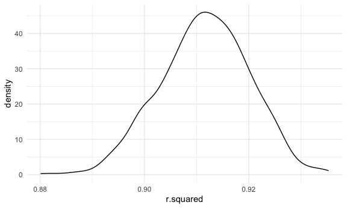
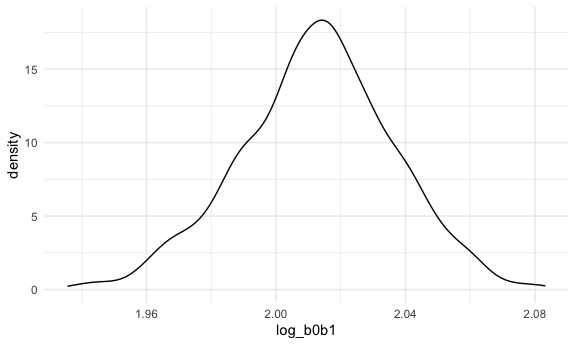

p8105_hw6_ltc2121
================
Lindsey Covell

## Problem 1

To obtain a distribution for $\hat{r}^2$, we’ll follow basically the
same procedure we used for regression coefficients: draw bootstrap
samples; the a model to each; extract the value I’m concerned with; and
summarize. Here, we’ll use `modelr::bootstrap` to draw the samples and
`broom::glance` to produce `r.squared` values.

``` r
weather_df = 
  rnoaa::meteo_pull_monitors(
    c("USW00094728"),
    var = c("PRCP", "TMIN", "TMAX"), 
    date_min = "2017-01-01",
    date_max = "2017-12-31") %>%
  mutate(
    name = recode(id, USW00094728 = "CentralPark_NY"),
    tmin = tmin / 10,
    tmax = tmax / 10) %>%
  select(name, id, everything())
```

    ## Registered S3 method overwritten by 'hoardr':
    ##   method           from
    ##   print.cache_info httr

    ## using cached file: ~/Library/Caches/R/noaa_ghcnd/USW00094728.dly

    ## date created (size, mb): 2022-03-22 14:09:01 (7.641)

    ## file min/max dates: 1869-01-01 / 2022-03-31

``` r
weather_df %>% 
  modelr::bootstrap(n = 1000) %>% 
  mutate(
    models = map(strap, ~lm(tmax ~ tmin, data = .x) ),
    results = map(models, broom::glance)) %>% 
  select(-strap, -models) %>% 
  unnest(results) %>% 
  ggplot(aes(x = r.squared)) + geom_density()
```



In this example, the $\hat{r}^2$ value is high, and the upper bound at 1
may be a cause for the generally skewed shape of the distribution. If we
wanted to construct a confidence interval for $R^2$, we could take the
2.5% and 97.5% quantiles of the estimates across bootstrap samples.
However, because the shape isn’t symmetric, using the mean +/- 1.96
times the standard error probably wouldn’t work well.

We can produce a distribution for $\log(\beta_0 * \beta1)$ using a
similar approach, with a bit more wrangling before we make our plot.

``` r
weather_df %>% 
  modelr::bootstrap(n = 1000) %>% 
  mutate(
    models = map(strap, ~lm(tmax ~ tmin, data = .x) ),
    results = map(models, broom::tidy)) %>% 
  select(-strap, -models) %>% 
  unnest(results) %>% 
  select(id = `.id`, term, estimate) %>% 
  pivot_wider(
    names_from = term, 
    values_from = estimate) %>% 
  rename(beta0 = `(Intercept)`, beta1 = tmin) %>% 
  mutate(log_b0b1 = log(beta0 * beta1)) %>% 
  ggplot(aes(x = log_b0b1)) + geom_density()
```



As with $r^2$, this distribution is somewhat skewed and has some
outliers.

The point of this is not to say you should always use the bootstrap –
it’s possible to establish “large sample” distributions for strange
parameters / values / summaries in a lot of cases, and those are great
to have. But it is helpful to know that there’s a way to do inference
even in tough cases.

## Problem 2

#### Data import and manipulation

``` r
washp_df = 
  read_csv("data/homicide-data copy.csv") %>% 
  filter(victim_race %in% c("White", "Black")) %>% 
  mutate(city_state = str_c(city, state, sep = ", "),
         resolved = as.numeric(disposition == "Closed by arrest"),
          victim_age = as.numeric(victim_age),
          victim_race = fct_relevel(victim_race, "White"))  %>% 
  filter(city != "Dallas" & city != "Phoenix" & 
           city != "Kansas City" & city_state != "Tulsa, AL") 
```

    ## Rows: 52179 Columns: 12
    ## ── Column specification ────────────────────────────────────────────────────────
    ## Delimiter: ","
    ## chr (9): uid, victim_last, victim_first, victim_race, victim_age, victim_sex...
    ## dbl (3): reported_date, lat, lon
    ## 
    ## ℹ Use `spec()` to retrieve the full column specification for this data.
    ## ℹ Specify the column types or set `show_col_types = FALSE` to quiet this message.

#### Baltimore, MD glm

``` r
balti_log = 
  washp_df %>% 
  filter(city == "Baltimore") %>%
  glm(resolved ~ victim_age + victim_race + victim_sex, data = ., family = binomial()) %>% 
  broom::tidy() %>% 
  mutate(OR = exp(estimate), 
         CI_low = exp(estimate - 1.96 * std.error), 
         CI_high = exp(estimate + 1.96 * std.error)) %>%
  filter(term == "victim_sexMale") %>% 
  select(term, OR, CI_low, CI_high) %>% 
  knitr::kable(digits = 3)
```

The results of the logistic regression in the table show that keeping
all other variables fixed, homicides in which the victim is male are
significantly less like to be resolved than those in which the victim is
female.

#### All cities glm

``` r
wash_logit = 
  washp_df %>% 
  select(city_state, resolved, victim_age, victim_race, victim_sex) %>% 
  nest(data = resolved:victim_sex) %>% 
  mutate(
    city_logs = map(.x = data, ~glm(resolved ~ victim_age + victim_race + victim_sex, data = .x, family = binomial())),
  city_res = map(city_logs, broom::tidy)) %>% 
  unnest(city_res) %>% 
  mutate(OR = exp(estimate), 
         CI_low = exp(estimate - 1.96 * std.error), 
         CI_high = exp(estimate + 1.96 * std.error)) %>%
  filter(term == "victim_sexMale") %>% 
  select(city_state, term, OR, CI_low, CI_high) 

wash_logit %>% 
  knitr::kable(digits = 3)
```

| city_state         | term           |    OR | CI_low | CI_high |
|:-------------------|:---------------|------:|-------:|--------:|
| Albuquerque, NM    | victim_sexMale | 1.767 |  0.831 |   3.761 |
| Atlanta, GA        | victim_sexMale | 1.000 |  0.684 |   1.463 |
| Baltimore, MD      | victim_sexMale | 0.426 |  0.325 |   0.558 |
| Baton Rouge, LA    | victim_sexMale | 0.381 |  0.209 |   0.695 |
| Birmingham, AL     | victim_sexMale | 0.870 |  0.574 |   1.318 |
| Boston, MA         | victim_sexMale | 0.674 |  0.356 |   1.276 |
| Buffalo, NY        | victim_sexMale | 0.521 |  0.290 |   0.935 |
| Charlotte, NC      | victim_sexMale | 0.884 |  0.557 |   1.403 |
| Chicago, IL        | victim_sexMale | 0.410 |  0.336 |   0.501 |
| Cincinnati, OH     | victim_sexMale | 0.400 |  0.236 |   0.677 |
| Columbus, OH       | victim_sexMale | 0.532 |  0.378 |   0.750 |
| Denver, CO         | victim_sexMale | 0.479 |  0.236 |   0.971 |
| Detroit, MI        | victim_sexMale | 0.582 |  0.462 |   0.734 |
| Durham, NC         | victim_sexMale | 0.812 |  0.392 |   1.683 |
| Fort Worth, TX     | victim_sexMale | 0.669 |  0.397 |   1.127 |
| Fresno, CA         | victim_sexMale | 1.335 |  0.580 |   3.071 |
| Houston, TX        | victim_sexMale | 0.711 |  0.558 |   0.907 |
| Indianapolis, IN   | victim_sexMale | 0.919 |  0.679 |   1.242 |
| Jacksonville, FL   | victim_sexMale | 0.720 |  0.537 |   0.966 |
| Las Vegas, NV      | victim_sexMale | 0.837 |  0.608 |   1.154 |
| Long Beach, CA     | victim_sexMale | 0.410 |  0.156 |   1.082 |
| Los Angeles, CA    | victim_sexMale | 0.662 |  0.458 |   0.956 |
| Louisville, KY     | victim_sexMale | 0.491 |  0.305 |   0.790 |
| Memphis, TN        | victim_sexMale | 0.723 |  0.529 |   0.988 |
| Miami, FL          | victim_sexMale | 0.515 |  0.304 |   0.872 |
| Milwaukee, wI      | victim_sexMale | 0.727 |  0.499 |   1.060 |
| Minneapolis, MN    | victim_sexMale | 0.947 |  0.478 |   1.875 |
| Nashville, TN      | victim_sexMale | 1.034 |  0.685 |   1.562 |
| New Orleans, LA    | victim_sexMale | 0.585 |  0.422 |   0.811 |
| New York, NY       | victim_sexMale | 0.262 |  0.138 |   0.499 |
| Oakland, CA        | victim_sexMale | 0.563 |  0.365 |   0.868 |
| Oklahoma City, OK  | victim_sexMale | 0.974 |  0.624 |   1.520 |
| Omaha, NE          | victim_sexMale | 0.382 |  0.203 |   0.721 |
| Philadelphia, PA   | victim_sexMale | 0.496 |  0.378 |   0.652 |
| Pittsburgh, PA     | victim_sexMale | 0.431 |  0.265 |   0.700 |
| Richmond, VA       | victim_sexMale | 1.006 |  0.498 |   2.033 |
| San Antonio, TX    | victim_sexMale | 0.705 |  0.398 |   1.249 |
| Sacramento, CA     | victim_sexMale | 0.669 |  0.335 |   1.337 |
| Savannah, GA       | victim_sexMale | 0.867 |  0.422 |   1.780 |
| San Bernardino, CA | victim_sexMale | 0.500 |  0.171 |   1.462 |
| San Diego, CA      | victim_sexMale | 0.413 |  0.200 |   0.855 |
| San Francisco, CA  | victim_sexMale | 0.608 |  0.317 |   1.165 |
| St. Louis, MO      | victim_sexMale | 0.703 |  0.530 |   0.932 |
| Stockton, CA       | victim_sexMale | 1.352 |  0.621 |   2.942 |
| Tampa, FL          | victim_sexMale | 0.808 |  0.348 |   1.876 |
| Tulsa, OK          | victim_sexMale | 0.976 |  0.614 |   1.552 |
| Washington, DC     | victim_sexMale | 0.690 |  0.468 |   1.017 |

#### Box plot for city estimates

``` r
wash_logit %>% 
  mutate(city_state = fct_reorder(city_state, OR)) %>% 
ggplot() +
  geom_point(aes(x = city_state, y = OR)) +
  geom_errorbar( aes(x = city_state, ymin = OR - CI_low, ymax = OR + CI_high)) +
  theme(axis.text.x = element_text(angle = 60, hjust = 1, size = 6)) +
   labs(
    title = "Odds of Homicide Being Solved", 
    subtitle = "Male Victims Compared to Female Victims",
    x = "US City",
    y = "Odds Ratio")
```


